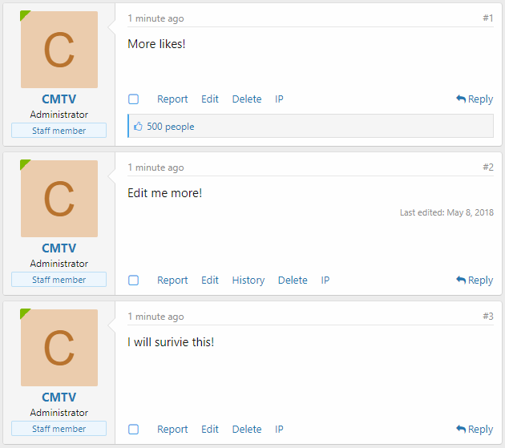
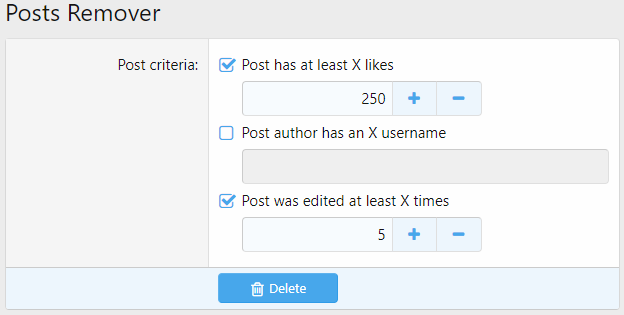
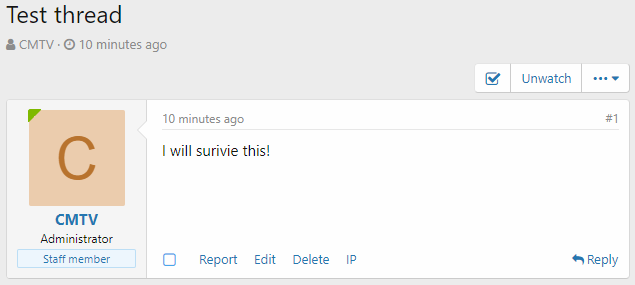

When XenForo needs to test something (user/page/post...) against some **user selected** conditions (criteria), it uses the Criteria system.

Some places, where the Criteria system is used:

-   Trophies
-   User-group promotions
-   Forum notices

Addons can also use this system.

## Criteria types

Consider the following criteria:

-   User has/has no avatar
-   User has more than 300 messages
-   User is creating a thread right now
-   Current user's selected navigation tab is "Members"

The first two criteria refer to the user himself. The remaining ones refer to his current location on the forum. It appears we have different categories or **types** of criteria.

There are two criteria types in XenForo out of the box:

-   User criteria — handling criteria about the user himself
-   Page criteria — handling criteria about user's current location + time criteria

Some addons may also add their own criteria types.

From the code perspective, criteria types are simply children of an abstract `AbstractCriteria` class. They contain code for handling the selected criteria of certain type.

`AbstractCriteria`, in turn, provides a general methods to work with criteria regardless of their meaning.

## Criterion

Criterion is a user selectable predefined condition.

**Why selectable?** Because admins/users can select them (remember trophy creation process).

**Why predefined?** Because XenForo already knows how to handle them (using methods in the Criteria classes).


Every criterion consists of two parts: **rule** and (optionally) **data**.

### Rule

The criterion rule is simply a sting in [snake case](https://en.wikipedia.org/wiki/Snake_case) (words_are_separated_with_underscore_character).

It has two essential purposes:

1. It is used to distinguish criteria
2. When performing matching, the rule is converted into a [camel case](https://en.wikipedia.org/wiki/Camel_case) name of a method that handles this criterion (see ["How criteria works"](#how-criteria-works)).

### Data

It is just an optional array of additional criterion data. For example, "User has posted at least X messages" criterion has a data array with one element: a number of messages.

## How criteria system works

In this sections, we describe how criteria system works from A to Z.

### Template

It all starts from template code. Here is how criteria look inside templates:

```html
<xf:checkbox label="Criteria container">
    
    <!-- Criterion -->
    <xf:option name="foo_criteria[criterion_1_rule][rule]" value="criterion_1_rule" ... />
    
    <!-- Criterion with data -->
    <xf:option name="bar_criteria[criterion_2_rule][rule]" value="criterion_2_rule" ... >
        <xf:... name="bar_criteria[criterion_2_rule][data][param_1]" ... />
        <xf:... name="bar_criteria[criterion_2_rule][data][param_2]" ... />
    </xf:option>
        
</xf:checkbox>
```

As you can see, criterion is simply a checkbox with optional input fields inside (criterion data). Let's analyze the code:

-   `foo_criteria` and `bar_criteria` are the input containers and usually `foo` and `bar` parts refer to criteria type. For example, `user_criteria[...]` lets us know that this criteria belong to User criteria.
-   `value="criterion_1_rule"` and `value="criterion_2_rule"` are, obviously, the rules of criteria.

!!! note
    Keep in mind that `criterion_1/2_rule` in `name` attributes may not have to be criteria rules! These are just names for input containers. You can easily write `<xf:option name="foo[bar][rule]" value="criterion_rule" />` and it will work correctly. The criterion name will be `criterion_rule`, not `bar`.

### (Optionally) Storing selected criteria

Inside the controller, the criteria form data from the previous section can be filtered, serialized and saved in database columns of `mediumblob` type for better days:

```php
$fooCriteriaInput = $this->filter('foo_criteria', 'array');
$barCriteriaInput = $this->filter('bar_criteria', 'array');

$form->basicEntitySave($bazEntity, [$fooCriteriaInput, $barCriteriaInput]);
```

The example `$bazEntity` structure:

```php
public static function getStructure(Structure $structure)
{
    $structure->table = 'xf_baz';
    $structure->shortName = 'XF:Baz';
    $structure->primaryKey = 'baz_id';
    $structure->columns = [
        'baz_id' => ['type' => self::UINT, 'autoIncrement' => true],
        'foo_criteria' => ['type' => self::SERIALIZED_ARRAY, 'default' => [], 'required' => 'please_select_criteria_that_must_be_met'],
        'bar_criteria' => ['type' => self::SERIALIZED_ARRAY, 'default' => []]
    ];

    return $structure;
}
```

### Criteria object

For using criteria system we need to create a criteria object from selected criteria form data. This can be done via app's `criteria()` method:

```php
/** @var \Qux\Criteria\Foo $fooCriteria */
$fooCriteria = \XF::app()->criteria('Qux:Foo', $bazEntity->foo_criteria);

/** @var \Qux\Criteria\Bar $barCriteria */
$barCriteria = \XF::app()->criteria('Qux:Bar', $bazEntity->bar_criteria);
```

From now, we can use all `AbstractCriteria` functionality plus everything we have additionally written in child `Foo`/`Bar` classes.

### Matching

When we want to check, whether something (User) matches the selected criteria or not, we use `isMatched` method:

```php
$visitor= \XF::visitor();

if ($fooCriteria->isMatched($visitor))
{
    // Visitor matches all selected criteria
}
else
{
    // Visitor does not match one or more criteria
}
```

`isMacthed()` converts criterion rule into camel case name of a method with `_match` prefix: `criterion_1_rule` > `_matchCriterion1Rule` and tries to find such a method inside criteria type class (`Foo` class in our example):

```php
// Qux/Criteria/Foo.php

protected function _matchCriterion1Rule(array $data, \XF\Entity\User $user)
{
    /* ... Handling criteria ... */
    
    return true; // User matches current criteria
    
    /* OR */
    
    return false; // User does not match current criteria
}
```

If some method can't be found in class, `isMatched()` calls `isUnknownMatched()` which behaviour can be set in `AbstractCriteria` ancestors (returns `false` by default).

If none criteria were selected, `isMatched()` returns `$matchOnEmpty` variable which equals `true` by default. You can change this behaviour by calling `$crteriaObj->setMatchOnEmpty(false)` **before** using `isMatched()` method:

```php
$visitor= \XF::visitor();

$fooCriteria->setMatchOnEmpty(false);

if ($fooCriteria->isMatched($visitor))
{
    // Visitor matches all selected criteria
}
else
{
    // Visitor does not match one or more criteria
}
```

## How criteria works (example)

Imagine you want to award with a trophy all users who have an avatar and have received at least 5 likes.

When creating a trophy, you select "User has an avatar" (rule `has_avatar`) and "User has received at least X likes" (rule `like_count`) criteria. The last one also has a data array with one element: a number of likes.

Your selected criteria stores in `user_criteria` column in `xf_trophy` table.

When XenForo decides to check, whether to award a user with a trophy or not, it converts rules into camel case method names:

-   `like_count` > `_matchLikeCount()`
-   `has_avatar` > `_matchHasAvatar()`

Since both of selected criteria are User criteria, XenForo addresses the User criteria class and tries to find such methods in it:

```php
// XF/Criteria/User.php

//...
protected function _matchLikeCount(array $data, \XF\Entity\User $user)
{
    return ($user->like_count && $user->like_count >= $data['likes']);
}
//...
protected function _matchHasAvatar(array $data, \XF\Entity\User $user)
{
    return $user->user_id && ($user->avatar_date || $user->gravatar);
}
//...
```
 
If **all** addressed methods return `true`, our user matches the selected criteria and therefore will be awarded with a trophy.

If some methods can't be found in User criteria class, XenForo calls `isUnknownMatched()` method, which in turn fires `criteria_user` event, allowing addon makers to add their custom criteria handlers (see ["Custom User/Page criterion example"](#custom-userpage-criterion-example)).

## Extra criteria data

Sometimes, when writing criteria template code, you need to access extra data, that is not passed with view params.

This is what `getExtraTemplateData()` method exists. By default, it contains existing user groups, languages, styles, time zones.

You can override this method in you custom criteria type class .

### Adding data in custom criteria type

Override `getExtraTemplateData()` method in your custom criteria class:

```php
public function getExtraTemplateData()
{
    $templateData = parent::getExtraTemplateData();

    $additionalData = [];

    /** @var \XF\Repository\Smilie $smilieRepo */
    $smilieRepo = \XF::repository('XF:Smilie');

    $additionalData['smilies'] = $smilieRepo->findSmiliesForList()->fetch();

    return array_merge($templateData, $additionalData);
}
```

### Adding data to existing criteria types

You can use `criteria_template_data` event listener to add you own extra criteria data:

```php
public static function criteriaTemplateData(array &$templateData)
{
    /** @var \XF\Repository\Smilie $smilieRepo */
    $smilieRepo = \XF::repository('XF:Smilie');

    $templateData['smilies'] = $smilieRepo->findSmiliesForList()->fetch();
}
```

## "helper_criteria" template
 
Whenever you as addon maker want to get a target user/admin a way to select User/Page/other addon's criteria (or even all at once), you can simply use `helper_criteria`.

In short, `helpter_criteria` is an admin template that allows to use criteria types checkbox-based interface in multiply places without copy-pasting the same code.

`helper_criteria` contains macros of **two** types: `*criteria_name*_tabs` and `*criteria_name*_panes` for every criteria type. Example: `user_tabs` and `user_panes` macros for User criteria type.

### Tabs

Tabs are used to distinguish different criteria types within the template they are used:


When using tabs, the first one often contains fields/options that are not related to criteria. Then goes criteria tabs.

In the image above, the first tab contains options for notice. First two tabs in the red box are related to User criteria type. The last one is related to Page criteria type.

Tabs in `helper_criteria` are grouped under criteria types macros:

```html
<xf:macro name="foo_tabs" arg-container="" arg-active="">
	<xf:set var="$tabs">
		<a class="tabs-tab{{ $active == 'foo' ? ' is-active' : '' }}"
			role="tab" tabindex="0" aria-controls="{{ unique_id('criteriaFoo') }}">Foo criteria</a>
        <a class="tabs-tab{{ $active == 'foo_extra' ? ' is-active' : '' }}"
           role="tab" tabindex="0" aria-controls="{{ unique_id('criteriaFooExtra') }}">Foo criteria extra</a>
	</xf:set>
	<xf:if is="$container">
		<div class="tabs" role="tablist">
			{$tabs|raw}
		</div>
	<xf:else />
		{$tabs|raw}
	</xf:if>
</xf:macro>
```

In the code above, `foo` is a criteria type. It has two tabs, one for general foo criteria and another for extra foo criteria.

### Panes

Panes simply contain criteria.

Just like tabs, panes in `helper_criteria` are grouped under criteria types macros:

```html
<xf:macro name="foo_panes" arg-container="" arg-active="" arg-criteria="!" arg-data="!">
	<xf:set var="$panes">
		<li class="{{ $active == 'foo' ? ' is-active' : '' }}" role="tabpanel" id="{{ unique_id('criteriaFoo') }}">

			<xf:checkboxrow label="Criteria group 1">
				<xf:option name="foo_criteria[criterion_1_rule][rule]" value="criterion_1_rule" ... />
			    <xf:option name="foo_criteria[criterion_2_rule][rule]" value="criterion_2_rule" ... />
			</xf:checkboxrow>
			
			<xf:checkboxrow label="Criteria group 2">
                <xf:option name="foo_criteria[criterion_3_rule][rule]" value="criterion_3_rule" ... />
                <xf:option name="foo_criteria[criterion_4_rule][rule]" value="criterion_4_rule" ... />
            </xf:checkboxrow>

		</li>
	</xf:set>

	<xf:if is="$container">
		<ul class="tabPanes">
			{$panes|raw}
		</ul>
	<xf:else />
		{$panes|raw}
	</xf:if>
</xf:macro>
```

### Using "helper_criteria"

To use "helper_criteria" functionality, you need to include its macros.

#### Preparing data

This section can be skipped if you **don't have** your selected criteria saved somewhere in database or the criteria type you want to use **does't** require any extra data.

First of all, you need to retrieve saved selected criteria and create a criteria object from them. In this section, we will be using Page criteria as an example:

```php
$savedCriteria = /* Retrieve it somehow... */

// Criteria object
$criteria = $this->app()->criteria('XF:Page', $savedCriteria)->getCriteriaForTemplate();

// Criteria extra data
$criteriaData = $criteria->getExtraTemplateData();

$viewParams = [
    /* ... */
    'criteria' => $criteria,
    'criteriaData' => $criteriaData
];
    
return $this->view(/* ... */, $viewParams);
```

#### Including without tabs

To include criteria without tabs you need to use an `<xf:macro...` tag with `arg-container` attribute set to `0`:

```html
<xf:macro template="helper_criteria" name="page_panes" arg-container="0" arg-criteria="{$criteria}" arg-data="{$criteriaData}" />
```

If you don't have saved criteria, you can just pass empty array `{{ [] }}` to an `arg-criteria` attribute. Don't forget to replace `page` in `page_panes` to the name of criteria type you want to use.

Keep in mind that all criteria is wrapped with `<li>` tag so you will need to apply some CSS styling (`list-style-type: none;` for example).

#### With tabs

In order to use criteria tabs, you will need to organise the page. Stick to the following example structure:

```html
<xf:form ... class="block">
	<div class="block-container">
	    
	    <!-- Tabs -->
		<h2 class="block-tabHeader tabs hScroller" data-xf-init="h-scroller tabs" role="tablist">
			<span class="hScroller-scroll">
			    <!-- Main tab where fields/options are located -->
				<a class="tabs-tab is-active" role="tab" tabindex="0" aria-controls="MAIN_TAB_ID">Main tab title</a>
				
				<!-- Criteria tabs -->
				<xf:macro template="helper_criteria" name="page_tabs" arg-userTabTitle="Custom tab name (optionally)" />
			</span>
		</h2>

        <!-- Panes -->
		<ul class="block-body tabPanes">
		    <!-- Main pane -->
			<li class="is-active" role="tabpanel" id="MAIN_TAB_ID">
				<!-- Fields and options -->
			</li>

            <!-- Criteria panes -->
			<xf:macro template="helper_criteria" name="page_panes"
				arg-criteria="{$criteria}"
				arg-data="{$criteriaData}" />
		</ul>

		<xf:submitrow sticky="true" icon="save" />
	</div>
</xf:form>
```

Again, if you don't have any saved or even don't suppose to have it, pass `{{ [] }}` to an `arg-criteria` attribute.

### Adding custom criteria type to "helper_criteria"

If you want to add a custom criteria type to `helper_criteira` template, you will need to create a template modification of `helper_criteria` template.

Go to "Appearance > Template modifications" in ACP, switch to "Admin" tab and hit "Add template modification" button.

We want to add our tab and pane at the very bottom of the template so switch "Search type" to "Regular expression".

Type `/$/` in "Find" field.

Finally, add the tab and the pane macros code in "Replace" field. Example:

```html
<xf:macro name="foo_tabs" arg-container="" arg-active="">
	<xf:set var="$tabs">
		<a class="tabs-tab{{ $active == 'foo' ? ' is-active' : '' }}"
			role="tab" tabindex="0" aria-controls="{{ unique_id('criteriaFoo') }}">Foo criteria</a>
        <a class="tabs-tab{{ $active == 'foo_extra' ? ' is-active' : '' }}"
           role="tab" tabindex="0" aria-controls="{{ unique_id('criteriaFooExtra') }}">Foo criteria extra</a>
	</xf:set>
	<xf:if is="$container">
		<div class="tabs" role="tablist">
			{$tabs|raw}
		</div>
	<xf:else />
		{$tabs|raw}
	</xf:if>
</xf:macro>

<xf:macro name="foo_panes" arg-container="" arg-active="" arg-criteria="!" arg-data="!">
	<xf:set var="$panes">
		<li class="{{ $active == 'foo' ? ' is-active' : '' }}" role="tabpanel" id="{{ unique_id('criteriaFoo') }}">

			<xf:checkboxrow label="Criteria group 1">
				<xf:option name="foo_criteria[criterion_1_rule][rule]" value="criterion_1_rule" ... />
			    <xf:option name="foo_criteria[criterion_2_rule][rule]" value="criterion_2_rule" ... />
			</xf:checkboxrow>
			
			<xf:checkboxrow label="Criteria group 2">
                <xf:option name="foo_criteria[criterion_3_rule][rule]" value="criterion_3_rule" ... />
                <xf:option name="foo_criteria[criterion_4_rule][rule]" value="criterion_4_rule" ... />
            </xf:checkboxrow>

		</li>
	</xf:set>

	<xf:if is="$container">
		<ul class="tabPanes">
			{$panes|raw}
		</ul>
	<xf:else />
		{$panes|raw}
	</xf:if>
</xf:macro>
```

Now, you can use your criteria everywhere (see ["Using helper_criteria"](#using-helper_criteria)).

## Custom User/Page criterion example

Let's say we want to create a criterion for checking whether our user has X or more likes on single message or not.

Since our criterion refers to user, we will be creating a criterion which belongs to User criteria.

### Adding template modification

First of all, we need to add our criterion to User criteria list. Go to "Template modifications" page in ACP, select "Admin" tab and hit "Add template modification" button in the upper right corner.

!!! warning
    If there is no "Admin" tab make sure you have enabled the [development mode](development-tools.md#enabling-development-mode)!
    
We will be modifying the `helper_criteria` template so write it to the "Template" field. In this example I will be using `likes_on_single_message` "Modification key" for this template modification.

Our criterion is about likes on messages. This means it should be under "Content and achievements" section. This means we simply need to find `<!--[XF:user:content_bottom]-->` and replace it with the following code:

```html
<xf:option name="user_criteria[likes_on_single][rule]" value="likes_on_single" selected="{$criteria.likes_on_single}"  label="Likes on single message:">
	<xf:numberbox name="user_criteria[likes_on_single][data][likes]" value="{$criteria.likes_on_single.likes}" size="5" min="0" step="1" />
</xf:option>

$0
```

From this moment we can already see and even set a value for our criterion when creating trophies, notices and user-group promotions.

### Adding code event listener

We have created our criterion. But it is unknown for XenForo, which will always return `false` when matching such criteria. We need to tell XenForo, what to do when it meets unknown criteria. 

Go to "Development > Code event listener" page and hit "Add code event listener" button.

Select `criteria_user` in "Listen to event" field (`user` because our criterion belongs to User criteria). In "Execute callback" field we should specify class and method to be called when matching criteria.

Create a file `Listener.php` in addon root folder if you haven't already and add a new method `criteriaUser` there:

```php
<?php

namespace YOUR_ADDON_ID;

class Listener
{
    public static function criteriaUser($rule, array $data, \XF\Entity\User $user, &$returnValue)
    {
        
    }
}
```

You can fill "Class" and "Method" fields with `YOUR_ADDON_ID\Listener` and `criteriaUser`, respectively.

### Handling criterion

Since our `criteriaUser` method is fired for every unknown criteria, we need to make sure `$rule` equals `likes_on_single` (the rule we specified in HTML markup):

```php
public static function criteriaUser($rule, array $data, \XF\Entity\User $user, &$returnValue)
{
    switch ($rule)
    {
        case 'likes_on_single':
            /** Handling code here! */
            break;
    }
}
```

Now, we need to write the code that actually checks whether a user has a message with X or more likes.

This can be easily achieved via simple SQL query, which selects one record from `xf_post` with more than X likes (`likes` column) and `user_id` equals currently matching user ID.

So, here is the query:

```SQL
SELECT `likes` FROM `xf_post` WHERE `user_id` = ? ORDER BY `likes` DESC LIMIT 1
```

And the method code:

```php
public static function criteriaUser($rule, array $data, \XF\Entity\User $user, &$returnValue)
{
    switch ($rule)
    {
        case 'likes_on_single':

            // Getting the database
            $db = \XF::db();

            // Database query for selecting the maximum number of likes for single user post
            $query = "SELECT `likes` FROM `xf_post` WHERE `user_id` = ? ORDER BY `likes` DESC LIMIT 1";

            // Retrieving the maximum number of likes
            $likes = $db->fetchOne($query, [$user->user_id]);

            // Checking that we have a result from database (we do expect a number)
            if (is_int($likes)) {
                // Returning true if user has a message with X or more likes or false if he has not
                $returnValue = ($likes >= $data['likes']);
            } else {
                $returnValue = false;
            }

            break;
    }
}
```

Pay attention to the following:

-   We are using `$user` variable for retrieving currently matching user. We can use this variable since our criterion belongs to **User** criteria.
-   We can access data via `$data` array. It contains data from fields [we have added](#adding-template-modification) in template modification. We have only added one `<xf:numberbox...` which `name` attribute equals `user_criteria[likes_on_single][data][likes]`. That is why we can use `$data['likes']` in the code above.

Everything is done right now. Let's test it!

### Testing (trophy)

Create an "All for one" trophy. On "User criteria" tab, "Likes on single message" field with, for example, 5.

Next, create a test message somewhere on you forum and then like it five times with five different users (or just set manually set a value of `likes` column).

Then, go to "Tools > Cron entries" and run "Update user trophies" cron by hitting arrows-circle button.


Nice!

!!! warning
    If you are not awarded with "All for one" trophy, try to sign out, sign in and re-running "Update user trophies" cron.

### Testing (notice)

Go to "Communication > Notices" and hit "Add notice" button. On "User criteria" tab, set "Likes on single message" field with, again, 5. Save the notice.

Next, create a test message somewhere on you forum and then like it five times with five different users (or just set manually set a value of `likes` column).

Now, you should see a notice:


You can [download](files/example-sources/all-for-one-criterion-2.0.10.zip) addon sources built based on this example (2.0.10).

## Custom criteria type example

Imagine we are creating an addon (addon ID: `PostsRemover`) for removing all posts that match selected criteria. A list of available criteria:

-   Post has at least X likes
-   Post author has an X username
-   Post was edited at least X times
-   Post was edited no more than X times
-   Post was published before X
-   Post was published after X

Obviously, for such criteria we need a new criteria type: Post criteria.

### Criteria type class

We should start by creating a new class `Post` that inherits `AbstractCriteria` within `Criteria` directory of our addon:

```php
<?php

namespace PostsRemover\Criteria;

use XF\Criteria\AbstractCriteria;

class Post extends AbstractCriteria
{

}
```

Now we need to write code for all criteria out addon supports. In this example, I will write the code for the first three criteria from the list above:

```php
<?php

namespace PostsRemover\Criteria;

use XF\Criteria\AbstractCriteria;

class Post extends AbstractCriteria
{
    // Post has at least X likes
    protected function _matchLikeCount(array $data, \XF\Entity\Post $post)
    {
        return ($post->likes && $post->likes >= $data['likes']);
    }

    // Post author has an X username
    protected function _matchUsername(array $data, \XF\Entity\Post $post)
    {
        return $post->username === $data['name'];
    }

    // Post was edited at least X times
    protected function _matchEditedCount(array $data, \XF\Entity\Post $post)
    {
        return $post->edit_count && $post->edit_count >= $data['count'];
    }

    /* ================ Handling other criteria ================ */
}
```

`isMatched(...)` method used to call `_match` methods we just created accepts only User entity, we are to write a custom variation of `isMatched()`, `isUnknownMatched()` and `isSpecialMatched()` methods.

Since we are creating Post criteria, we need to create our own `isMatchedPost()` method:

```php
public function isMatchedPost(\XF\Entity\Post $post)
{
    if (!$this->criteria)
    {
        return $this->matchOnEmpty;
    }

    foreach ($this->criteria AS $criterion)
    {
        $rule = $criterion['rule'];
        $data = $criterion['data'];

        $specialResult = $this->isSpecialMatchedPost($rule, $data, $post);
        if ($specialResult === false)
        {
            return false;
        }
        else if ($specialResult === true)
        {
            continue;
        }

        $method = '_match' . \XF\Util\Php::camelCase($rule);
        if (method_exists($this, $method))
        {
            $result = $this->$method($data, $post);
            if (!$result)
            {
                return false;
            }
        }
        else
        {
            if (!$this->isUnknownMatched($rule, $data, $post))
            {
                return false;
            }
        }
    }

    return true;
}

protected function isSpecialMatchedPost($rule, array $data, \XF\Entity\Post $post)
{
    return null;
}

protected function isUnknownMatchedPost($rule, array $data, \XF\Entity\Post $post)
{
    return false;
}
```

We simply used `isMatched(...)` method code replacing `$user` variable of User entity type with `$post` variable of Post entity type.

As we do not plan to handle special and unknown criteria we return null in `isSpecialMatchedPost` and `false` in `isUnknownMathcedPost` methods.


### Template

Leaving the process of adding an admin route, writing a controller and doing other actions behind the scenes, let's jump right to our page's template code:

```html
<xf:title>Posts Remover</xf:title>

<xf:form action="{{ link('posts-remover/remove') }}" ajax="true" class="block">
	<div class="block-container">
		<xf:checkboxrow label="Post criteria">

			<xf:option label="Post has at least X likes" name="post_criteria[like_count][rule]" value="like_count">
				<xf:numberbox name="post_criteria[like_count][data][likes]" size="5" min="0" step="1" />
			</xf:option>

			<xf:option label="Post author has an X username" name="post_criteria[username][rule]" value="username">
				<xf:textbox name="post_criteria[username][data][name]" ac="true" />
			</xf:option>

			<xf:option label="Post was edited at least X times" name="post_criteria[edited_count][rule]" value="edited_count">
				<xf:numberbox name="post_criteria[edited_count][data][count]" size="5" min="0" step="1" />
			</xf:option>

		</xf:checkboxrow>
		
		<!-- Template code for other criteria -->
		
		<xf:submitrow sticky="true" icon="delete"/>
	</div>
</xf:form>
```

### Matching the criteria

In the controller of our page, we need to create a method called `actionRemove` for handling "Remove" button click:

```php
public function actionRemove()
{
}
```

Firstly, let's retrieve `post_criteria` array from page form:

```php
public function actionRemove()
{
    $postCriteriaInput = $this->filter('post_criteria', 'array');
}
```

Secondly, we need to create a criteria object from retrieved page form data:

```php
public function actionRemove()
{
    $postCriteriaInput = $this->filter('post_criteria', 'array');

    /** @var \PostsRemover\Criteria\Post $postCriteria */
    $postCriteria = $this->app()->criteria('PostsRemover:Post', $postCriteriaInput);
}
```

By default, out post **will match** the empty criteria (when nothing has been selected) which will result in deletion of all forum posts. To avoid this we need to manually set the result of matching the empty criteria via `setMatchOnEmpty()` method:

```php
public function actionRemove()
{
    $postCriteriaInput = $this->filter('post_criteria', 'array');

    /** @var \PostsRemover\Criteria\Post $postCriteria */
    $postCriteria = $this->app()->criteria('PostsRemover:Post', $postCriteriaInput);

    $postCriteria->setMatchOnEmpty(false); // If no criteria selected, nothing will be removed
}
```

Finally, we need to match all forum posts against selected criteria. If the post matches the criteria, we will delete it:

```php
public function actionRemove()
{
    $postCriteriaInput = $this->filter('post_criteria', 'array');

    /** @var \PostsRemover\Criteria\Post $postCriteria */
    $postCriteria = $this->app()->criteria('PostsRemover:Post', $postCriteriaInput);

    $postCriteria->setMatchOnEmpty(false); // If no criteria selected, nothing will be removed

    // Getting all forum posts
    $posts = $this->finder('XF:Post')->fetch();

    $deletedCounter = 0;

    /** @var \XF\Entity\Post $post */
    foreach ($posts as $post)
    {
        if ($postCriteria->isMatchedPost($post)) // Checking the post against selected criteria
        {
            $post->delete(); // Deleting it if the post matches the selected criteria
            $deletedCounter++;
        }
    }

    return $this->message('Done! ' . $deletedCounter . ' posts were removed!');
}
```

!!! note
    Keep in mind that we use `isMatchedPost($post)` method for XenForo versions below 2.1!

!!! warning
    It is generally a bad practice to retrieve all entities from database at once (`$this->finder('XF:Post')->fetch();` in the code above). There could be millions of forum posts and selecting them all at once is going to be a very long process, which might end up with an error.
    Consider using a Job system for working with dozens (100+) of database items.
    
### Testing

Time to test our custom criteria type!

I have created three posts on my test forum. The first one was liked 500 times, the second one was edited 5 times. The third one is just an ordinary untouched post without likes.



Now, on our "Posts Remover" ACP page, let's select "Post has at least X likes" (with value of 250) and "Post was edited at least X times" (wih value of 5):



When I hit "Delete" button, I saw a flash message telling me that nothing was deleted. Why? Obviously, because there are no posts with at least 250 likes and at least 5 edits **in the same time**.

That is why we need to select the first criterion only, then hit "Delete". This will delete a post with 500 likes. Next, we need to select the last criterion only and preform deletion. The post with 5 edits will be removed.

As a result, only one test post survived out test:



You can [download](files/example-sources/posts-remover-2.0.10.zip) addon sources built based on this example (2.0.10). You will find "Posts Remover" ACP page under "Tools" section.